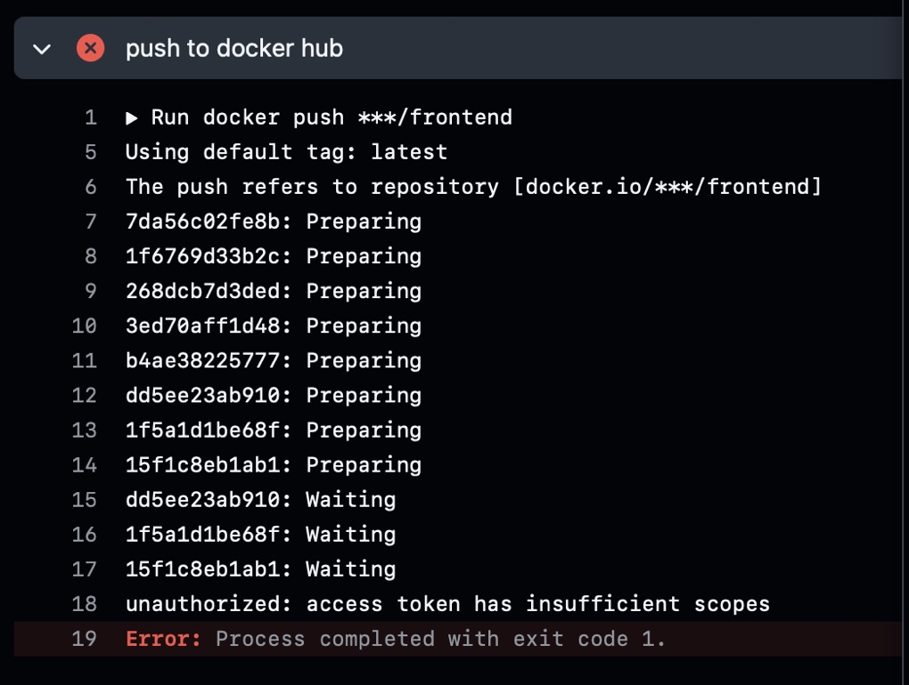
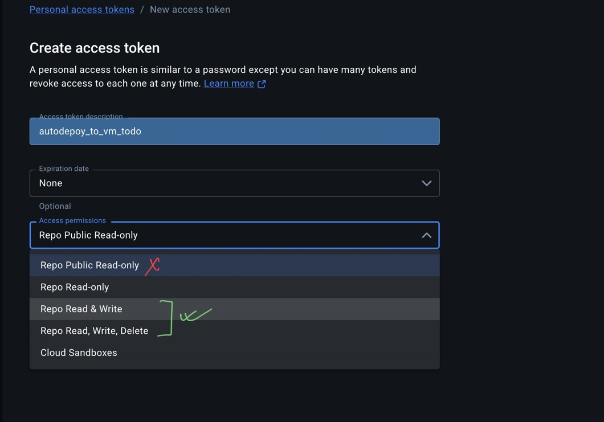
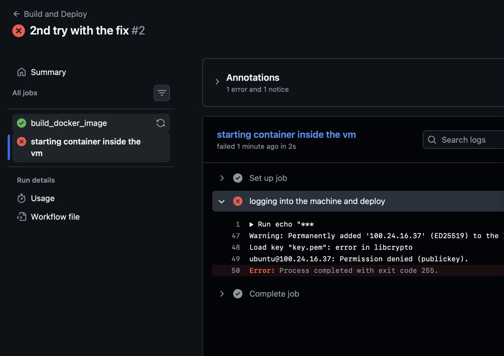
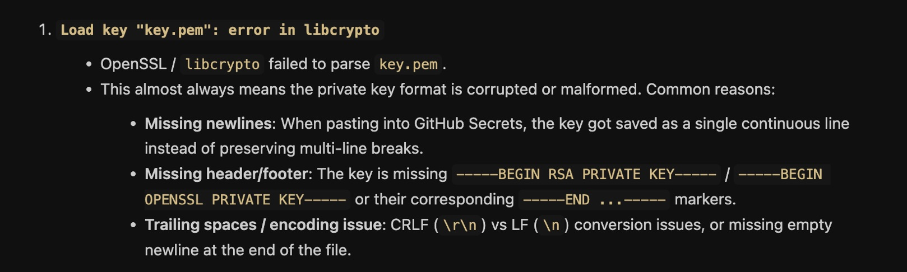
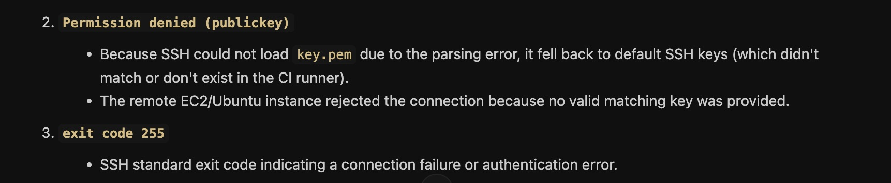
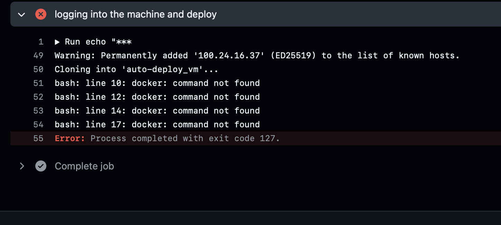

### Issue 1: The docker hub login issue :
- this happens because the access token you generated has insufficient permissions; 

#### Fix: 

### Issue 2: The github action ubuntu machine cannot ssh into the virtual machine 

- when i copy the value of the private key i did not include the `BEGIN RSA PRIVATE KEY, BEGIN RSA END KEY `,  i just copied the values only 
### Fix: 

### Issue 3: 

- docker was not installed , the fix is to installed docker 
