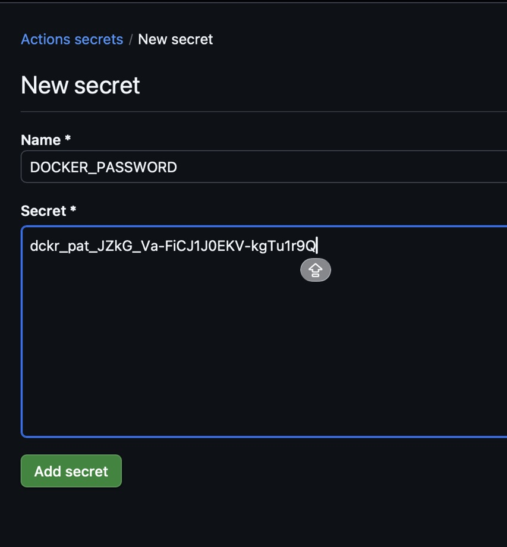
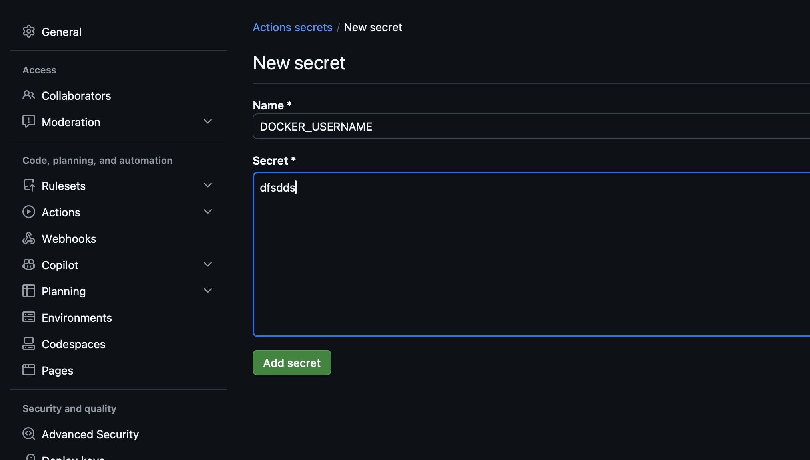

### There are 2 ways to add secrets to a ci/cd file , \
#### 1. Hardcoding the values inside the file itself . 
You just hard coded the values in  you `.yml` file 

#### 2. Using it dynamically through code 


You add the secrets as a `New repository secret` and then import it in the file 

##### The syntax to import the secrets is: 
```bash
${{ secrets.YOUR_SECRET_NAME }}
```
###### For example, from the above image if you want to import `DOCKER_PASSWORD`it would be :
```
${ secrets.DOCKER_PASSWORD }
```

### Key things to remember:

- The secret name in GitHub must match exactly what you write in secrets.YOUR_NAME
- GitHub will hide the value in logs automatically — it will show as ***
- Secrets are only available to workflows in the same repo