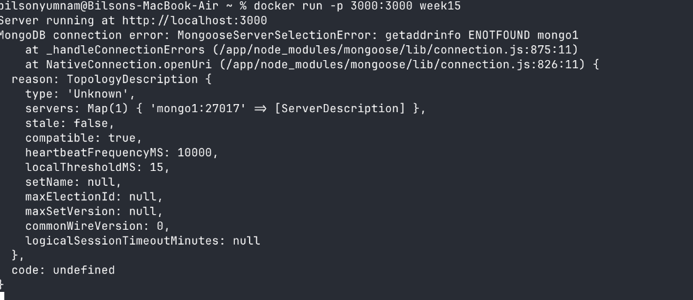
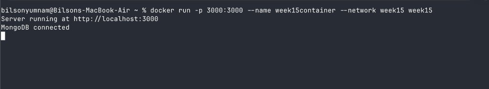
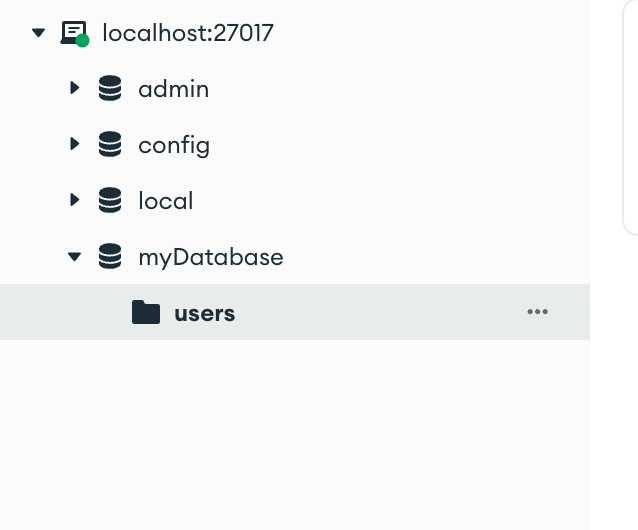
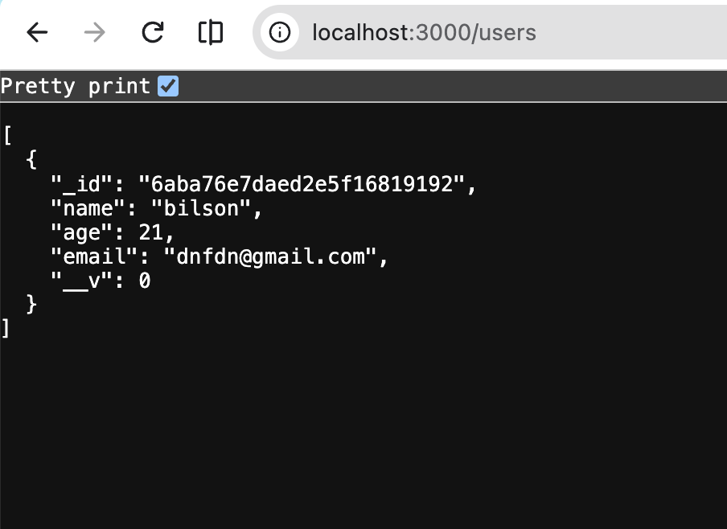

When you run multiple services(container) in Docker—like a Node.js backend and a MongoDB database—they run in separate, isolated containers. By default, they do not know each other exist.

This guide explains:
1. Why containers can't talk to each other out of the box using `localhost`.
2. Why Docker user-defined networks are the correct solution.
3. How Docker's internal DNS makes container communication seamless.
4. Step-by-step reproduction and fix of the `getaddrinfo ENOTFOUND` error using our codebase.

---

## 1. The Core Problem: Why `localhost` Fails Inside Containers

When you run an app on your host machine (your laptop), connecting to a local MongoDB instance is straightforward:

```typescript
const mongoUrl = 'mongodb://localhost:27017/myDatabase';
```

This works because both the app process and the MongoDB process share the **same network namespace**—your host machine's loopback interface (`127.0.0.1`).

### What changes inside Docker?
Every Docker container gets its own isolated network stack:
- Container A (`week15container`) has its own `localhost` (`127.0.0.1`).
- Container B (`mongo1`) has its own `localhost` (`127.0.0.1`).

```
+-------------------------------------------------------------------+
| Host Machine                                                      |
|                                                                   |
|   +--------------------------+     +--------------------------+   |
|   | Container A (Node.js)    |     | Container B (MongoDB)    |   |
|   |                          |     |                          |   |
|   | localhost = Container A  |     | localhost = Container B  |   |
|   +--------------------------+     +--------------------------+   |
|                 \                               /                 |
|                  X   Cannot talk via localhost X                  |
+-------------------------------------------------------------------+
```

If Container A makes a request to `localhost:27017`, it is querying **itself**. Since MongoDB is running in Container B, the connection fails immediately (`ECONNREFUSED`).

---

## 2. Default Bridge vs. User-Defined Bridge

Docker automatically provides a default network called `bridge`. If you don't specify a `--network` flag when running a container, it attaches to this default bridge.

### The Catch with the Default Bridge
On the default bridge:
- Containers can only reach each other by **raw IP addresses** (e.g., `172.17.0.3`).
- **Automatic DNS resolution by container name is disabled.**

Hardcoding container IPs is impractical: every time a container restarts or is recreated, Docker assigns it a new dynamic IP address.

### The Solution: User-Defined Bridge Network
When you create a custom network (e.g. `docker network create week15`):
- Docker enables an **embedded DNS server** at `127.0.0.11`.
- Any container attached to this network can reach any other container on the same network simply by using its **container name** as the hostname.

| Feature | Default `bridge` | User-Defined Network (`docker network create`) |
| :--- | :--- | :--- |
| **DNS Resolution by Name** | ❌ No (`getaddrinfo ENOTFOUND`) |  Yes (automatic via container name) |
| **Isolation** | ❌ All unassigned containers share it |  Isolated to containers explicitly joined |
| **Hot-Plugging** | ❌ Cannot disconnect while running |  Can connect/disconnect on the fly |

---

## 3. Network Architecture for the Project

Here is the high-level architecture of how our Node.js app (`week-15-live-2.2`), MongoDB, and host tools interact:

```
+------------------------------------------------------------------------------------+
| HOST MACHINE (Mac)                                                                 |
|                                                                                    |
|   Browser: http://localhost:3000  ──(port 3000:3000)──┐                            |
|                                                       │                            |
|   MongoDB Compass: localhost:27017 ──(port 27017:27017)──────┐                     |
|                                                       │      │                     |
|   +---------------------------------------------------│------│-----------------+   |
|   | Docker Network: `week15`                          ▼      ▼                 |   |
|   |                                                                            |   |
|   |   +-------------------------+              +---------------------------+   |   |
|   |   | Container: week15container |           | Container: mongo1         |   |   |
|   |   | Image: week15           |              | Image: mongo              |   |   |
|   |   | Port: 3000              |              | Port: 27017               |   |   |
|   |   |                         |  DNS query   |                           |   |   |
|   |   | mongoose.connect(       | "mongo1:27017"                           |   |   |
|   |   |   'mongodb://mongo1...')|─────────────>| Internal IP resolved      |   |   |
|   |   +-------------------------+              +---------------------------+   |   |
|   +----------------------------------------------------------------------------+   |
+------------------------------------------------------------------------------------+
```

Notice:
1. **Between containers** (`week15container` -> `mongo1`): Communication happens completely inside the `week15` Docker network using the hostname `mongo1`.
2. **From Host to containers**:
   - Port `3000:3000` lets your browser or curl access the Node.js API.
   - Port `27017:27017` lets MongoDB Compass on your Mac connect to the database container directly.

---

## 4. Codebase Reference (`week-15-live-2.2`)
```
├── 📁 src
│   ├── 📄 db.ts
│   └── 📄 index.ts
├── ⚙️ .dockerignore
├── ⚙️ .gitignore
├── 🐳 Dockerfile
├── ⚙️ package-lock.json
├── ⚙️ package.json
└── ⚙️ tsconfig.json
```

(Github link to the codebase:)[https://github.com/100xdevs-cohort-2/week-15-live-2.2/tree/main]
### 1. `src/db.ts`
Notice line 3: the connection string explicitly uses the hostname `mongo1`:

```typescript
import mongoose, { Schema, model } from 'mongoose';

// Hostname is 'mongo1', NOT 'localhost'
const mongoUrl: string = 'mongodb://mongo1:27017/myDatabase';

// Connect to MongoDB
mongoose.connect(mongoUrl)
  .then(() => console.log('MongoDB connected'))
  .catch(err => console.error('MongoDB connection error:', err));

interface IUser {
  name: string;
  age: number;
  email: string;
}

const UserSchema: Schema = new Schema<IUser>({
  name: { type: String, required: true },
  age: { type: Number, required: true },
  email: { type: String, required: true }
});

export const User = model<IUser>('User', UserSchema);
```

### 2. `src/index.ts`
Defines two endpoints:
- `POST /user`: creates and saves a new user record.
- `GET /users`: retrieves all user records from MongoDB.

```typescript
import express, { Express, Request, Response } from 'express';
import { User } from './db';

const app: Express = express();
const port: number = 3000;

app.use(express.json());

app.post('/user', async (req: Request, res: Response) => {
  const { name, age, email } = req.body;
  const newUser = new User({ name, age, email });

  try {
    const savedUser = await newUser.save();
    res.status(201).send({ message: 'User created', user: savedUser });
  } catch (err) {
    res.status(500).send({ message: 'Error creating user', error: err });
  }
});

app.get('/users', async (req: Request, res: Response) => {
  try {
    const users = await User.find();
    res.status(200).send(users);
  } catch (err) {
    res.status(500).send({ message: 'Error fetching users', error: err });
  }
});

app.listen(port, () => {
  console.log(`Server running at http://localhost:${port}`);
});
```

### 3. `Dockerfile`
A standard TypeScript Node.js build:

```dockerfile
FROM node:alpine

WORKDIR /app

COPY package* .

RUN npm install

COPY . .

RUN npm run build

EXPOSE 3000

CMD ["node", "dist/index.js"]
```

---

## 5. Walkthrough: The Failure and The Fix

### Step 1: Build the Application Image

From the project root:

```bash
docker build -t week15 .
```

Docker compiles TypeScript into `dist/` and prepares the image tagged `week15`.

---

### Step 2: The Error — Running Without a Shared Network

If you try to run the application directly:

```bash
docker run -p 3000:3000 week15
```

The container starts, but immediately crashes or logs a connection failure:



```text
Server running at http://localhost:3000
MongoDB connection error: MongooseServerSelectionError: getaddrinfo ENOTFOUND mongo1
    at _handleConnectionErrors (/app/node_modules/mongoose/lib/connection.js:875:11)
    at NativeConnection.openUri (/app/node_modules/mongoose/lib/connection.js:826:11) {
  reason: TopologyDescription {
    type: 'Unknown',
    servers: Map(1) { 'mongo1:27017' => [ServerDescription] },
...
  code: undefined
}
```

#### Why did this happen?
1. The code in `db.ts` called `mongoose.connect('mongodb://mongo1:27017/myDatabase')`.
2. The operating system inside the container made a DNS query for the host `mongo1`.
3. Because this container was on the default bridge network (no `--network` flag provided), Docker's embedded DNS was not present to resolve container names.
4. The system resolver returned `ENOTFOUND` (Error: Name Not Found).

---

### Step 3: The Fix — Create Network and Run Both Containers

To fix this, both containers must live on the same user-defined network, and the MongoDB container must be named `mongo1`.

#### 1. Create the user-defined network
```bash
docker network create week15
```

#### 2. Start the MongoDB container on `week15` with `--name mongo1`
```bash
docker run -d -p 27017:27017 --name mongo1 --network week15 mongo
```

Key flags:
- `--network week15`: Joins the `week15` virtual network.
- `--name mongo1`: Gives the container the DNS hostname `mongo1`.
- `-p 27017:27017`: Exposes port 27017 to your host machine so GUI tools like MongoDB Compass can connect.

#### 3. Start the application container on `week15`
```bash
docker run -p 3000:3000 --name week15container --network week15 week15
```

Output:



```text
Server running at http://localhost:3000
MongoDB connected
```

#### Why it works now:
Both containers are inside the `week15` network. When Node.js asks to resolve `mongo1`, Docker's internal DNS (`127.0.0.11`) resolves it directly to the private IP assigned to `mongo1`. The connection succeeds immediately.

---

## 6. Testing and Verification

### 1. Verifying Database Connection with MongoDB Compass

Because MongoDB was started with `-p 27017:27017`, we can open MongoDB Compass on the host machine and connect to:

```text
mongodb://localhost:27017
```

Once connected, we can verify that `myDatabase` exists and contains the `users` collection:



---

### 2. Testing the API Endpoints

#### Adding a User (POST `/user`)
You can send a POST request with curl, Postman, or Thunder Client:

```bash
curl -X POST http://localhost:3000/user \
  -H "Content-Type: application/json" \
  -d '{"name": "bilson", "age": 21, "email": "dnfdn@gmail.com"}'
```

Response:
```json
{
  "message": "User created",
  "user": {
    "name": "bilson",
    "age": 21,
    "email": "dnfdn@gmail.com",
    "_id": "6aba76e7daed2e5f16819192",
    "__v": 0
  }
}
```

#### Fetching Users (GET `/users`)
Open your browser and navigate to:
```text
http://localhost:3000/users
```

The browser returns the saved user document from MongoDB through our containerized Express server:



This confirms the entire flow is working end-to-end:
- Host browser ➔ Node.js container (`localhost:3000`)
- Node.js container ➔ MongoDB container (`mongo1:27017` via `week15` network)
- Host Compass ➔ MongoDB container (`localhost:27017`)

---

## 7. Useful Docker Network Commands Quick Reference

| Command | What it does |
| :--- | :--- |
| `docker network create <name>` | Creates a new user-defined bridge network |
| `docker network ls` | Lists all existing networks on the Docker daemon |
| `docker network inspect <name>` | Displays detailed network metadata, subnet, gateway, and connected containers with their IPs |
| `docker network connect <net> <container>` | Connects an already running container to a network without restarting it |
| `docker network disconnect <net> <container>` | Disconnects a container from a network |
| `docker network rm <name>` | Removes an unused network |
| `docker network prune` | Removes all unused user-defined networks |

### Inspecting Connected Containers
To see which containers are currently attached to `week15` and view their internal IP addresses:

```bash
docker network inspect week15
```

Inside the JSON output, the `"Containers"` block will show:
```json
"Containers": {
    "...": {
        "Name": "mongo1",
        "IPv4Address": "172.18.0.2/16"
    },
    "...": {
        "Name": "week15container",
        "IPv4Address": "172.18.0.3/16"
    }
}
```

---

## Summary Checklist

1. **Never use `localhost`** inside a container to refer to another container.
2. **Do not rely on the default bridge** if you need container-to-container name resolution.
3. **Always create a user-defined network**: `docker network create <name>`.
4. **Name your containers with `--name`**: The container name becomes the DNS hostname inside that network.
5. **Publish ports (`-p`) only when needed by the host**: Containers on the same custom network can communicate over any port directly without exposing it to the host machine.
