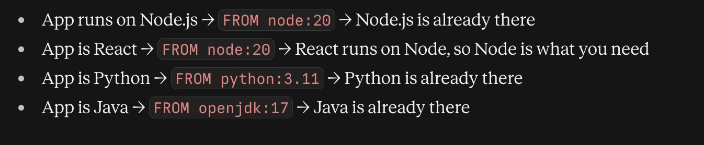
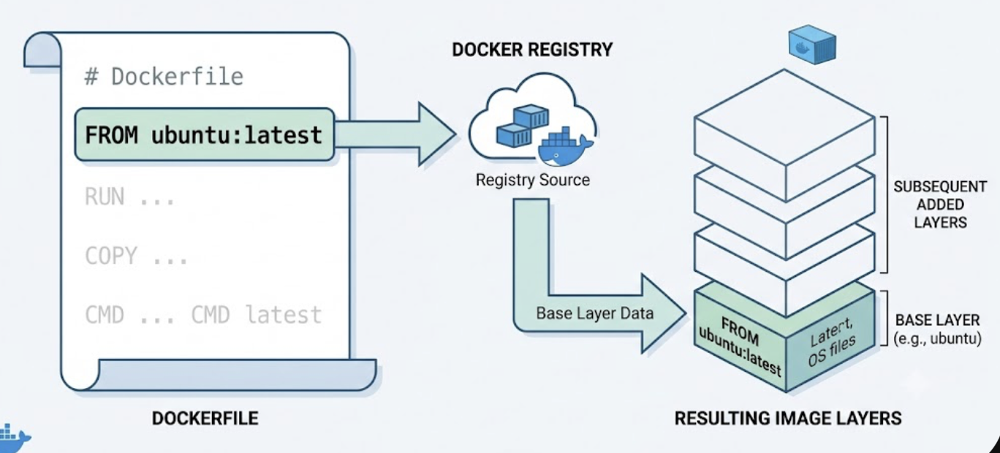
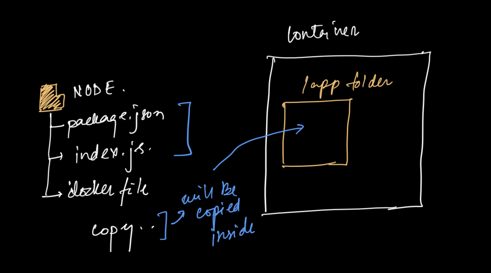
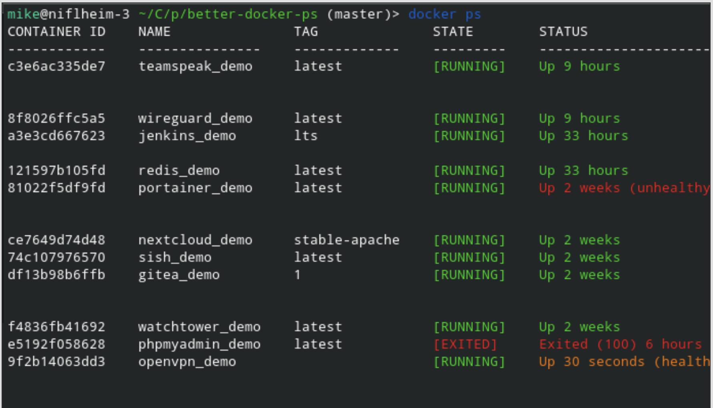

Everything in this note is the foundation of using docker — the instructions that go inside a `Dockerfile` and the commands you run against those images.

## The Dockerfile at a glance
```dockerfile
FROM node:18          # 1. start from a base image
WORKDIR /app          # 2. pick a working directory
COPY package*.json ./ # 3. bring your code in
RUN npm install       # 4. run commands at build time
CMD ["node", "server.js"]  # 5. the default job when the container starts
```
- the above file is written inside a file called Dockerfile(no extension )
---
---

# FROM — The Base Image

## What is `FROM` ?

`FROM` is the first line in almost every Dockerfile. It tells Docker:

> **"What should already be ready before my app runs?"**
> `FROM` = "someone already set up the environment my app needs, I just use it."



When Docker starts a container, it begins as a **completely empty void** — no OS, no files, no tools, nothing. Your app cannot float in empty space. It needs a floor to stand on.

`FROM` is that floor.

132.png)

```dockerfile
FROM python:3.11
```

This one line says — *"I don't want to set up Python myself. I want it already there and ready."* although you could build it yourself without ready made already available

## Why Does `FROM` Even Need to Exist?

The problem is:

> **Your app cannot run alone. But "setting up everything from scratch every time" is painful and breaks across different machines.**

**Without Docker at all** — your app needs an OS, the right language, the right version of everything, all set up *exactly right.* And the nightmare — it works on your laptop, breaks on your teammate's laptop, breaks again on the server. Because every machine is slightly different.

**Docker's answer** was — *"What if the app carried its own environment with it?"*

But then a new problem appeared:

> Every time you build a container, do you really want to build an entire OS from zero?

That's thousands of steps. Massive. Slow. Painful. People would be doing the exact same setup work over and over again.

**That's the problem `FROM` solves.**

Instead of building from zero every time — someone builds the foundation once, uploads it to Docker Hub, and you just say:

```dockerfile
FROM python:3.11
```

*"Start me from the point where Python is already done."*

So `FROM` exists because of **two connected problems:**
- Environments differ everywhere → containers fix that
- Building a full environment from zero every time → `FROM` fixes *that*

> `FROM` is basically saying — **"don't start from zero, start from here."**

---

## The Best Example

**A laptop that the IT team set up before giving it to you.**

Before your first day at a new job, the IT team:
- Installs the OS
- Installs Python
- Sets up the tools you need

When you arrive, you just **open it and write your code.**

That is exactly `FROM python:3.11` — someone already prepared the environment. You just add your app on top.

What this example preserves that beginners usually miss:

- The laptop is **not your personal computer** → the container is not your machine
- You didn't set it up → you didn't build the base image, someone on Docker Hub did
- What's on it determines what you can do → if they didn't install `bash`, you don't have `bash`
- Your code goes **on top of it**, not inside it → your app layers on top of the base

> `FROM` is the laptop IT gave you. Your code is what you do once you open it.

---

## Common Examples

| FROM | What is already ready |
|---|---|
| `FROM python:3.11` | Linux + Python + pip |
| `FROM node:20` | Linux + Node.js + npm |
| `FROM ubuntu:22.04` | Just a basic Ubuntu system |
| `FROM alpine` | Tiny Linux (~5MB), almost nothing else |
| `FROM scratch` | Truly empty. Absolutely nothing. |

---

## What Confuses Beginners

**1. "My computer is Ubuntu, why am I writing `FROM ubuntu` again?"**
The base image has nothing to do with your computer's OS. The container is a completely separate, isolated world. Your machine could be Windows and your container can run Ubuntu inside — they don't interfere.

**2. "`FROM python:3.11` vs `FROM ubuntu` + installing Python"**
They can give the same result. But `FROM python:3.11` means someone already did the Ubuntu + install Python work for you. Most base images are just other Dockerfiles that someone already built and uploaded to Docker Hub.

**3. The `latest` trap**
```dockerfile
FROM node:latest  ❌
FROM node:20      ✅
```
`latest` changes over time. One day it's Node 20, next month it's Node 22 and your app breaks. Always pin a version.

**4. Smaller image ≠ easier to work with**
`FROM alpine` is only ~5MB which sounds great. But Alpine is so minimal that many normal tools (`bash`, `curl`, common libraries) are simply not there. Beginners pick it thinking small = simple, then spend hours debugging missing packages.

**5. The base image is downloaded, not created**
`FROM python:3.11` doesn't generate anything. Docker just pulls it from Docker Hub — it's a file someone else made and uploaded. No internet = it fails.

---

> `FROM` tells you the **DNA of the container.** Everything after it is just what you add on top.

---
---

# WORKDIR in Docker

## The one-line idea

> `WORKDIR` tells Docker: **"Where should all the following commands run inside the container?"**

That's the whole concept. Everything else is just detail.

---

## The problem it solves

> **Why can't I just run commands without it?**

When Docker runs a command inside a container, it starts from the **root** `/` directory by default. No memory. No context. Just root, every single time.

This creates real trouble:

**1. Your files land in the wrong place**
Without `WORKDIR`, your `COPY` puts files directly into `/` — right next to system files like `/bin`, `/etc`, `/var`. Your `app.js` sits next to the OS. That's chaos.

**2. Commands run in the wrong folder**
`RUN npm install` runs from `/` instead of your project folder. It either fails or installs in the wrong place.

**3. You have to repeat `cd` every single time**
`cd` inside a `RUN` command doesn't stick. Docker forgets it after each step.

```dockerfile
# Without WORKDIR — painful
RUN cd /app && npm install
RUN cd /app && npm run build
RUN cd /app && node server.js
```

> Docker has no memory of "where you are" between commands. `WORKDIR` gives it that memory.

---

## How it works

```dockerfile
WORKDIR /app
```

This does two things:
- **Creates** `/app` inside the container if it doesn't exist
- **Sets** `/app` as the current directory for every command that follows

```dockerfile
WORKDIR /app

COPY . .                   # goes into /app
RUN npm install            # runs inside /app
RUN npm run build          # still inside /app
CMD ["node", "server.js"]  # starts from /app
```



Clean. No repetition. No confusion.

---

## What happens if you use it multiple times?

> **Can I change the working directory mid-Dockerfile?**

Yes. Each `WORKDIR` replaces the previous one.

```dockerfile
WORKDIR /app
RUN echo "I am in /app"

WORKDIR /app/config
RUN echo "Now I am in /app/config"
```

You can also use a relative path:

```dockerfile
WORKDIR /app
WORKDIR src        # becomes /app/src
WORKDIR utils      # becomes /app/src/utils
```

---

## What about CMD and ENTRYPOINT?

> **Does WORKDIR affect what runs when the container starts?**

Yes. `WORKDIR` applies to `CMD` and `ENTRYPOINT` too — not just `RUN` and `COPY`.

```dockerfile
WORKDIR /app
CMD ["node", "server.js"]
# Docker looks for server.js inside /app — correct
```

Without `WORKDIR`, Docker looks for `server.js` in `/` — and fails.

---

## A real example (Node.js app)

```dockerfile
FROM node:18

# Set working directory
WORKDIR /app

# Copy dependency files first (better caching)
COPY package*.json ./

# Install dependencies
RUN npm install

# Copy the rest of the code
COPY . .

# Build the app
RUN npm run build

# Start
CMD ["node", "dist/server.js"]
```

Everything happens inside `/app`. Clean structure. No paths repeated. No guessing.

---

## Quick rules to remember

| Situation | What WORKDIR does |
|---|---|
| Folder doesn't exist | Creates it automatically |
| Used multiple times | Each one replaces the last |
| Relative path given | Builds on top of the previous WORKDIR |
| Affects `RUN`, `COPY`, `ADD`, `CMD`, `ENTRYPOINT` | Yes, all of them |

---

## The mental model

Think of `WORKDIR` like `cd` in your terminal — but smarter:
- It **persists** across every step (unlike `cd` inside `RUN`)
- It **creates** the folder if missing (unlike `cd` which would error)
- It's the **home base** your container always returns to

---
---

# CMD in Docker

## The one-line idea

> `CMD` tells Docker: **"What should the container do when it starts?"**

That's it. It's the container's default job. No `CMD` — the container wakes up with nothing to do.

For example: For a nodejs project, which is containerised when the container is started it will be starting the `index.js` file

---

## The problem it solves

> **Why can't I just type the command when I run the container?**

You can. But that means every single person who runs your image — including future you — has to know and type the right command manually.

Without `CMD`, three things go wrong:

**1. You repeat yourself every time**
```bash
# Every. Single. Time.
docker run myimage node server.js
docker run myimage node server.js
docker run myimage node server.js
```
Forget it once — nothing runs. No error. Just silence.

**2. The image doesn't know what it's for**
Anyone who pulls your image has to guess how to start it. The image is not self-contained. That's bad design.

**3. In production, silence looks like success**
A container starts, has nothing to do, and exits immediately. No crash message. No error. Just gone. Very hard to debug.

> Without `CMD`, a container is a box with no instructions on what to do when opened.

---

## How it works

```dockerfile
CMD ["node", "server.js"]
```

Now this just works:
```bash
docker run myimage
# → runs: node server.js
```

The image knows its own job. No typing. No guessing.

---

## The two ways to write CMD

**1. Exec form — the right way**
```dockerfile
CMD ["node", "server.js"]
```
- Uses JSON array format
- Runs the command directly — no shell in between
- Signals work correctly (important for graceful shutdowns)

**2. Shell form — the risky way**
```dockerfile
CMD node server.js
```
- Docker wraps this in `/bin/sh -c`
- A shell process runs between Docker and your app
- `CTRL+C` and kill signals may not reach your app properly

> Always prefer exec form `["node", "server.js"]` unless you have a specific reason not to.

---

## CMD can be overridden

> **What if I want to run something different just this once?**

CMD is a *default* — not a lock. You can override it at runtime:

```bash
docker run myimage node debug.js
# ignores CMD, runs debug.js instead
```

This is intentional. CMD says "do this by default" — not "always do this no matter what."

---

## What happens with multiple CMDs?

> **Can I have more than one CMD?**

You can write multiple, but only the **last one** runs. Everything before it is ignored.

```dockerfile
CMD ["node", "server.js"]   # ignored
CMD ["node", "worker.js"]   # ignored
CMD ["node", "app.js"]      # this one runs
```

Don't rely on this behavior — it's confusing. Keep one `CMD` per Dockerfile.

---

## CMD vs RUN — a common confusion

> **Both run commands. What's the difference?**

| | RUN | CMD |
|---|---|---|
| When | During **image build** | When **container starts** |
| Purpose | Install, compile, configure | Start your app |
| How many times | Every build | Every `docker run` |
| Example | `RUN npm install` | `CMD ["node", "app.js"]` |

`RUN` builds the image. `CMD` runs the image.

---

## A real example (Node.js app)

```dockerfile
FROM node:18

WORKDIR /app

COPY package*.json ./
RUN npm install

COPY . .
RUN npm run build

CMD ["node", "dist/server.js"]
```

`RUN` handles everything during build. `CMD` handles what happens when someone does `docker run`.

---

## What about ENTRYPOINT?

> **I've seen ENTRYPOINT too. How is it different from CMD?**

Both define what runs at startup — but they behave differently:

| | CMD | ENTRYPOINT |
|---|---|---|
| Can be overridden | Yes, easily | Only with `--entrypoint` flag |
| Good for | Default commands | Commands that must always run |
| Used together | Acts as default arguments | Acts as the fixed base command |

When used together:
```dockerfile
ENTRYPOINT ["node"]
CMD ["server.js"]         # default argument to node
```

```bash
docker run myimage              # runs: node server.js
docker run myimage worker.js    # runs: node worker.js
```

`ENTRYPOINT` locks the command. `CMD` provides the default argument that can be swapped.

---

## Quick rules to remember

| Situation | Behavior |
|---|---|
| No CMD in Dockerfile | Falls back to base image CMD (or fails) |
| Multiple CMDs | Only the last one runs |
| Override at runtime | `docker run myimage other-command` |
| Exec vs Shell form | Always prefer exec: `["node", "app.js"]` |
| With ENTRYPOINT | CMD becomes the default argument |

---

## The mental model

Think of `CMD` as the container's **default job description**:
- It tells the container what to do when it wakes up
- It can be overridden when you need something different
- Without it, the container has no job — and exits immediately

---
---

# Some Basic Docker Commands

##  `docker ps` — List Running Containers

Shows all **currently running** containers. Think of it like a task manager for Docker.

```bash
docker ps
```

Add `-a` to also see **stopped** containers:

```bash
docker ps -a
```

**Example output:**
```
CONTAINER ID   IMAGE       COMMAND       STATUS         NAMES
a3f1b2c4d5e6   nginx       "/docker…"    Up 2 hours     my-web-server
```



> **Tip:** The `CONTAINER ID` and `NAMES` column are useful — you'll need them in other commands.

---

## `docker build` — Build an Image from a Dockerfile

Reads your `Dockerfile` and creates a Docker image from it. You run this before you run a container.

```bash
docker build -t <image-name> <path-to-dockerfile>
```

**Example:**
```bash
docker build -t my-app .
```

- `-t my-app` → gives the image the name `my-app`
- `.` → means "look for the Dockerfile in the current folder"

> **Tip:** Every time you change your `Dockerfile`, rebuild the image with this command.

---

##  `docker kill` — Force Stop a Running Container

Immediately stops a container. Unlike `docker stop` (which asks nicely), `docker kill` cuts it off right away.

```bash
docker kill <container-name-or-id>
```

**Example:**
```bash
docker kill my-web-server
```

Or using the container ID:
```bash
docker kill a3f1b2c4d5e6
```

> **Tip:** Use `docker kill` when a container is frozen or not responding to `docker stop`.

---

##  `docker exec` — Run a Command Inside a Running Container

Lets you "enter" a container or run a command inside it — without restarting it.

Command like : ls( to check what files are available in the docker image) , cat package.json etc

```bash
docker exec <options> <container-name-or-id> <command>
```

**Example — open an interactive shell inside a container:**
```bash
docker exec -it my-web-server bash
```

- `-i` → interactive (keep input open)
- `-t` → allocates a terminal (so it looks like a normal shell)
- `bash` → the command to run inside the container

**Example — run a single command without entering the shell:**
```bash
docker exec my-web-server ls /etc/nginx
```

> **Tip:** If `bash` doesn't work, try `sh` — some minimal images don't have bash installed.


## COPY in Dockerfile

`COPY` moves files from your computer into the Docker image.

### Basic syntax

```dockerfile
COPY <source> <destination>
```

- **source** → path on your computer (outside Docker)
- **destination** → path inside the Docker image

---

### How WORKDIR affects COPY

`WORKDIR` sets the current directory inside the image. After that, any `.` (dot) means that directory.

```dockerfile
WORKDIR /app     # Docker is now "standing inside" /app
COPY . .         # copies everything into /app
```

These two are identical:

```dockerfile
# Option 1
WORKDIR /app
COPY . .

# Option 2
WORKDIR /app
COPY . /app
```

---

### Copying a single file

```dockerfile
WORKDIR /app

COPY requirements.txt .                       # → /app/requirements.txt
COPY requirements.txt /app                    # → same thing
COPY requirements.txt /app/requirements.txt   # → same thing, most explicit
```

You can also rename while copying:

```dockerfile
COPY requirements.txt deps.txt   # saved as /app/deps.txt
```

---

### Why some people write `COPY file1 file1`

Both of these do the same thing:

```dockerfile
COPY requirements.txt .                # shorter
COPY requirements.txt requirements.txt # more explicit
```

It is just **personal preference** — writing the filename twice makes it very clear what the source and destination are, without needing to remember what `WORKDIR` is set to.

---

### Common real-world pattern

```dockerfile
FROM python:3.11

WORKDIR /app

COPY requirements.txt .          # copy this first
RUN pip install -r requirements.txt

COPY . .                         # then copy everything else
```

> Copy `requirements.txt` first so Docker can cache that layer. If your code changes but requirements don't, Docker skips re-installing packages → faster builds.

---

### COPY vs ADD

| | `COPY` | `ADD` |
|---|---|---|
| Copy local files | ✅ | ✅ |
| Unzip `.tar` files automatically | ❌ | ✅ |
| Download from URL | ❌ | ✅ |

**Rule:** Always prefer `COPY` unless you need the extra features of `ADD`.

---

### .dockerignore tip

Create a `.dockerignore` file to stop certain files from being copied:

```
node_modules
.env
__pycache__
*.log
```

This keeps your image small and clean.


---

##  Quick Reference

| Command | What it does |
|---|---|
| `docker ps` | List running containers |
| `docker ps -a` | List all containers (including stopped) |
| `docker build -t name .` | Build an image from a Dockerfile |
| `docker kill <name>` | Force stop a container |
| `docker exec -it <name> bash` | Open a shell inside a container |

---

[More about port mapping:](/notes/docker/portMapping/)
