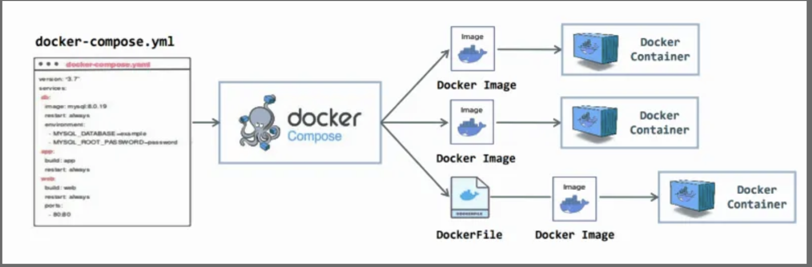
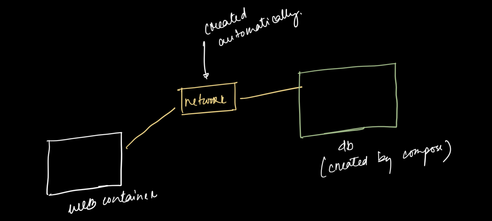
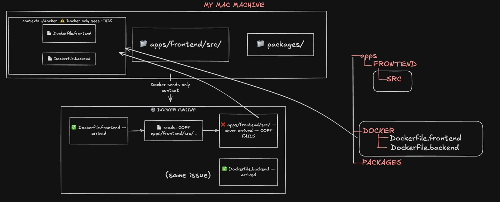
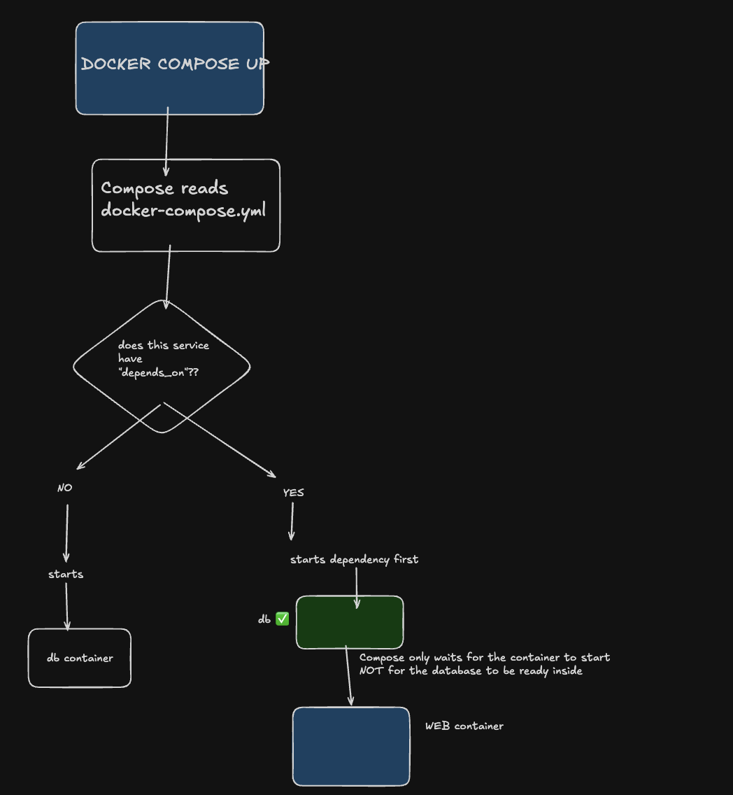

# A GUIDE on How to Write a Docker Compose File

---

## What is Docker Compose?



Docker Compose solves the **"multiple services (container) problem.**

If you have a web application you have the project + data + redis( if you cache data) and and many more and is not one thing — it is several things working together. For example, a typical web application has:

| Service              | What it does                    |
| -------------------- | ------------------------------- |
| **Web app** (Node)   | Handles user requests           |
| **Database** (Mongo) | Stores data                     |
| **Cache** (Redis)    | Remembers frequent answers fast |

These services need to **talk to each other** and **start in the right order.**

Without Compose, you would run 3 separate commands, create a network manually, and pass environment variables one by one. It is easy to make mistakes

With Compose — one file, one command:

```bash
docker compose up
```

> **Important:** Compose is not a replacement for Docker. It is a convenience layer on top of Docker. It still uses the same images, same containers, same networking — it just automates the coordination. like we talked above

---

## When You Do NOT Need Docker Compose

> Compose solves the "multiple services(container)" problem. If you don't have that problem, you don't need it.

| Situation                          | Need Compose? |
| ---------------------------------- | -------------- |
| 1 service only                     | ❌ No          |
| 2+ services talking to each other | ✅ Yes         |
| Local development environment      | ✅ Almost always yes |
| Production on Kubernetes / AWS ECS | ❌ No          |
| One-time script or job             | ❌ No          |
| Still learning basic Docker        | ❌ Not yet     |

---

## Understanding the Network

This is the part most guides skip — and it causes real confusion.

### The question beginners ask

When the web app connects to the database like this:

```
DATABASE_URL: mongo://mongo1:secret@db:5432/myapp
```

People ask: *"How does `web` know where `db` is? I never gave an IP address. I never set up a network."*

### What actually happens

When you run `docker compose up`, Compose **automatically creates a private network** and attaches all your services(containers) to it.



( db should be mongo1)

Inside this network, **every service name becomes a hostname.** So `db` is not just a label in your YAML file — it is a real address(like ip address in internet) that `web` can reach.

This is why you write `@mongo` in the database URL instead of `@localhost` or an IP address.

### Why not use localhost?

Each container is its own isolated environment. `localhost` inside the `web` container means the `web` container itself — not the `db` container. They are separate boxes. The shared network is the bridge between them.

### You can also define networks manually

For most projects you do not need this. But when you have many services and want to control which ones can talk to each other, you can be explicit:

```yaml
services:
  web:
    networks:
      - app_network
  db:
    networks:
      - app_network

networks:
  app_network:
```

By default, if you write nothing, Compose creates one network and puts all services on it automatically.

---

## Writing a Docker Compose File From First Principles

Every line in the file answers one of 5 questions. Ask these questions for each service — and you can write any Compose file.

| Question                               | YAML Key           |
| -------------------------------------- | ------------------ |
| What image to run?                     | `image` or `build` |
| What does the container needs to know? | `environment`      |
| How do I reach it from outside?        | `ports`            |
| What data must survive restarts?       | `volumes`          |
| Which container must start first?      | `depends_on`       |

---

### Step 1 — Name your services(container)

Start by just listing the container you will need. Nothing else yet.

```yaml
services:
  web:
  db:
```

- you have 2 container names: web and db (it is like docker run image_name) {the image part}

---

### Step 2 — What image does each container use?

```yaml
services:
  web:
    build: .            # build from your own code (needs a Dockerfile)
  db:
    image: postgres:15  # download ready-made image from Docker Hub
```

- `build: .` → look at current folder, find Dockerfile, build it
- `image:` → download from Docker Hub, no build needed

`build: .` is the short version of:

```yaml
build:
  context: .
  dockerfile: Dockerfile
```

Docker assumes:
- `context` = `.` (current folder)
- `dockerfile` = `Dockerfile` (default name)

####  What is `context`?
`context` is the folder that Docker sends to Docker Engine before building. 
Docker can **only see and copy files that are inside this folder.**




#### When do you need `context` + `dockerfile`?
**Same level**(the dockerfile and compose file) → shorthand is enough:
```
root/
├── docker-compose.yml
└── Dockerfile
```

```yaml
web:
  build: .   # works
```
**Different level** → you must be explicit:

```
root/
├── docker-compose.yml
└── docker/
    └── Dockerfile.frontend
```
```yaml
web:
  build:
    context: .                              #  root — sees all source files
    dockerfile: docker/Dockerfile.frontend  # exact path to Dockerfile
```

#### Why context must point to source code
The Dockerfile gives Docker **instructions.** (copy, run etc)
The context gives Docker **the files to work with.** (the files to copy  ....)

`COPY` inside a Dockerfile only works on files that **arrived inside the context.** [Context](./howtowrite.md#what-is-context)
So if the context does not give the /app folder , the docker file has copy ./app/frontend/package.json , but it does not arrive in the context , so there will be issue 

```dockerfile
COPY apps/frontend/src/ .   # ❌fails if context does not include apps/
```

So if your project looks like this:
```
root/
├── apps/frontend/   ← source code
├── docker/          ← Dockerfiles
└── docker-compose.yml
```

You must use `context: .` (root) so Docker can see **both** the source code and the Dockerfile path.


---

### Step 3 — What does each service (container) need to know?

Ask: *what would break if I didn't provide this?*

```yaml
services:
  web:
    build: .
    environment:
      DATABASE_URL: mongo://mongo1:secret:5432/myapp

  db:
    image: postgres:15
    environment:
      MONGO_PASSWORD: secret
      MONGO_DB: myapp
```

---

### Step 4 — How do you access the web app from your browser?

Everything is inside Docker by default. You need to open a door — this is called **port mapping.**

```yaml
  web:
    ports:
      - "8000:8000"   # your machine port : container port
```

You only expose the web app. The database does not need to be reachable from outside.

---

### Step 5 — What data needs to survive when containers stop?

If you stop the database container, all data is gone. You need a **volume.**

```yaml
  db:
    volumes:
      - db_data:/var/lib/postgresql/data

volumes:
  db_data:    # declare at the bottom
```

A volume is a folder that lives **outside the container**, so data survives restarts and `docker compose down`.

---

### Step 6 — What starts first?



- this tells which container starts first , For example: in a full stack application with a database, starting the database is the most logical things , because the full stack might need to connect to the database and if the database is not up and running it will be a problem

```yaml
  web:
    depends_on:
      - db
```

> ⚠️ **Warning:** `depends_on` only waits for the container to **start** — not for the database inside to be fully ready. Your app can still crash if Postgres needs a few more seconds. This is one of the most common beginner traps.

---

### The Complete File

```yaml
services:
  web:
    build: .
    ports:
      - "8000:8000"
    environment:
      DATABASE_URL: postgres://postgres:secret@db:5432/myapp
    depends_on:
      - db

  db:
    image: postgres:15
    environment:
      POSTGRES_PASSWORD: secret
      POSTGRES_DB: myapp
    volumes:
      - db_data:/var/lib/postgresql/data

volumes:
  db_data:
```

---

## Common Beginner Confusions

### 1. "Does Compose replace Docker?"

No. Compose is just a tool that sits on top of Docker. Same images, same containers.

### 2. `depends_on` does not mean "wait until ready"

It only waits for the container to start — not for the service inside (like Postgres) to be fully ready. Your app can crash because the DB needs a few more seconds.

### 3. The network feels invisible

Compose creates a private network automatically. Service names become hostnames. This is never obvious from looking at the file — but now you know (see the Network section).

### 4. `docker-compose` vs `docker compose`

```bash
docker-compose up   # old way
docker compose up   # new way
```

Two commands, same result. Many tutorials use both. They are not different tools.

### 5. Data disappears after `docker compose down`

Without volumes, your database is wiped every time. Always define a volume for any service that stores data.

### 6. The file name must be exact

The file should be named `docker-compose.yml` or `compose.yaml`. A typo in the name and the command won't find it.

---

## The Mental Model to Remember

```
docker compose up
      │
      ├── creates a private network
      ├── pulls or builds each image
      ├── starts containers in dependency order
      └── connects everything together
```

The "aha moment" usually comes when you try to do all of this **without Compose** and feel the pain. That's when the value becomes clear.
