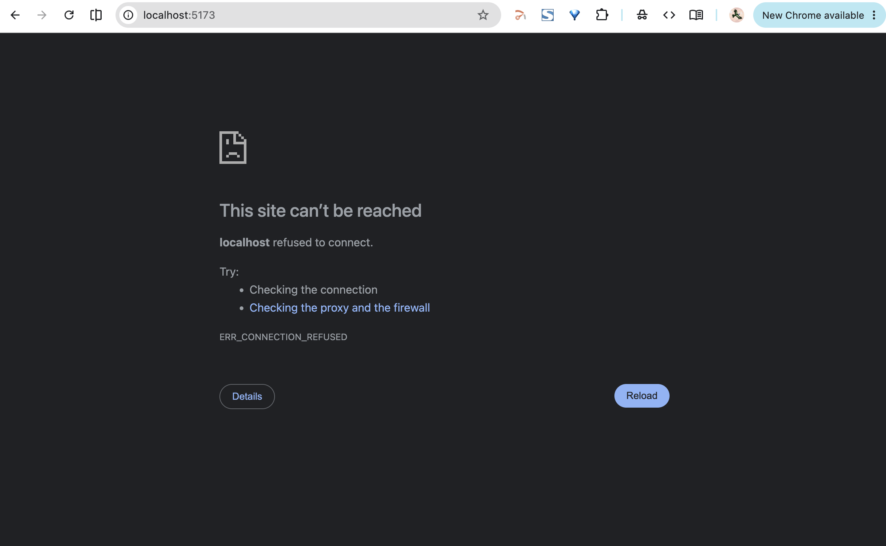
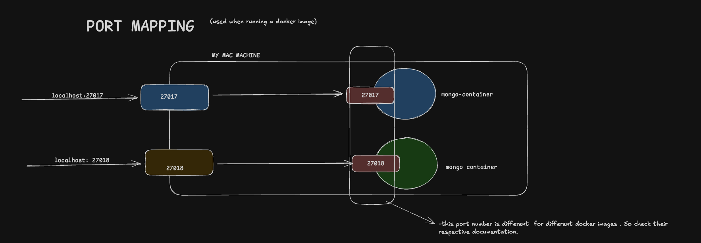

- when you  run  start a react server, `https://localhost:5173` you see the react webpage,


- if you run put it in a docker container and visit the same `link`  you wont see the webpage
- this is because there is no `port mapping`


- the webpage is not listening to the user `machine port number 5173` but instead listening to the `container port number 5163`,
- if we `mapped them` , then visit the webpage you will see the webpage again


### PORT MAPPING SYNTAX:
```
docker run [OPTIONS] IMAGENAME [COMMAND]
```
How to Map ports in Docker?:[Link](https://www.geeksforgeeks.org/devops/how-to-map-ports-in-docker/)

[More about port mapping:](/notes/docker/mongoDblocal/#docker-lets-you-run-mongodb-without-installing-it)

***Example***
```
docker run -p 8080:3000 your-app
#             ↑      ↑
#           (host)  (container)
```