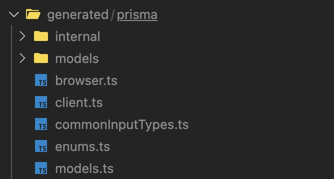
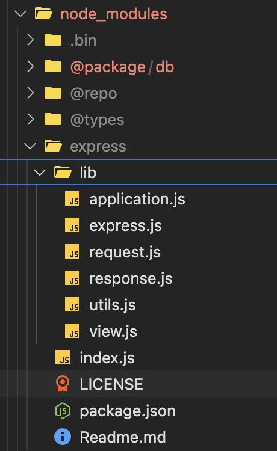

---

title: Prisma Module Not Found in Monorepo
description: this note will clear your doubt you have about importing prisma instance made in packages/db to app/http-server
type: NOTE
year: 2026
tags: [mono repo, prisma, prisma client, bug, package manager]
---

## 1. The Error Message

When running `pnpm run dev` in the `http-server` workspace, the following error occurs:

```text
node:internal/modules/esm/resolve:275
    throw new ERR_MODULE_NOT_FOUND(
          ^

Error [ERR_MODULE_NOT_FOUND]: Cannot find module '/.../packages/db/generated/prisma/client.js' imported from /.../packages/db/client.ts
  code: 'ERR_MODULE_NOT_FOUND',
  url: 'file://.../packages/db/generated/prisma/client.js'
```

---

## 2. Monorepo File Tree Example

Here is a simplified structure of the monorepo showing where the files live and where the broken link occurs:

```text
my-turborepo/
├── apps/
│   └── http-server/
│       ├── package.json               <-- Depends on "@package/db": "workspace:*"
│       ├── tsconfig.json
│       ├── src/
│       │   └── index.ts               <-- Imports "@package/db/prismaClient"
│       ├── dist/
│       │   └── index.js               <-- Compiled by tsc, executed by Node
│       └── node_modules/
│           └── @package/
│               └── db                 <-- [SYMLINK] points to packages/db
│
└── packages/
    └── db/
        ├── package.json               <-- Exports "./prismaClient": "./client.ts"
        ├── client.ts                  <-- Imports "./generated/prisma/client.js"
        ├── prisma/
        │   └── schema.prisma          <-- Prisma 7 generator outputs to ../generated/prisma
        └── generated/
            └── prisma/
                ├── client.ts          <-- ONLY TypeScript files exist here!
                ├── enums.ts
                └── (NO client.js!)    <-- ❌ The file Node is looking for does not exist
```

---

## 3. Minimal Code Required to Reproduce the Issue

### Step A: In `packages/db/prisma/schema.prisma`
When tou run `npx prisma generate`
In lower prisma version , prisma generate generates files into `node_modules/@prisma/client`.
Those generated files in node_modules include pre-built JavaScript files and .d.ts types.
Code simply imports from @prisma/client:

```javascript
import { PrismaClient } from "@prisma/client"
```
Because it imports from node_modules/@prisma/client, Node finds the pre-built JavaScript files.


Prisma 7 generates raw TypeScript source code directly into a custom folder:

```prisma
generator client {
  provider = "prisma-client"
  output   = "../generated/prisma" //custom folder
}

datasource db {
  provider = "postgresql"
}
```
This told Prisma: "Don't put compiled JavaScript into node_modules. Put raw TypeScript files (.ts) directly inside packages/db/generated/prisma." unlike lower version


### Step B: In `packages/db/client.ts`
TypeScript ESM syntax requires imports to end with `.js`:

```typescript
import { PrismaClient } from "./generated/prisma/client.js"

const prisma = new PrismaClient()
export default prisma
```

### Step C: In `packages/db/package.json`
The package exports raw TypeScript source directly:

```json
{
  "name": "@package/db",
  "type": "module",
  "exports": {
    "./prismaClient": "./client.ts"
  }
}
```

### Step D: In `apps/http-server/src/index.ts`
The application imports from the workspace package:

```typescript
import prisma from "@package/db/prismaClient"
```

### Step E: In `apps/http-server/package.json`
The dev script runs `tsc -b` and then directly runs `node`(dist/index.js):
Or it could be 
1. run `tsc -b` first in terminal 
2. the dev script run `node`(dist/index.js)


this will generate the issue at [go to 1](#1-the-error-message)

```json
{
  "name": "http-server",
  "type": "module",
  "scripts": {
    "dev": "tsc -b && node dist/index.js"
  },
  "dependencies": {
    "@package/db": "workspace:*"
  }
}
```

---

## 4. Normal Package Manager vs. Workspaces (Symlinks)

Understanding this difference is key to understanding why this bug happened:

### A. Installing a Normal Package (like `express`)

1. `pnpm install` downloads pre-built **JavaScript** files from the npm registry.
2. It places those `.js` files inside `node_modules/express`.
3. When Node runs, it reads pure JavaScript files that are ready to execute.

### B. Installing a Workspace Package (`workspace:*`)
1. `pnpm install` does **not** download anything from npm.
2. It does **not** compile your code.
3. Instead, it creates a **symlink** (a shortcut pointer) inside `apps/http-server/node_modules/@package/db` that points directly to your raw source folder `packages/db`. (../../packages/db)[File structure](#2-monorepo-file-tree-example)
 [another_reference_about_symlink](https://cms-git-harkirat-cms-bilsonyumnams-projects.vercel.app/UNDERSTANDING-MONO-AND-TURBO-REPO/Mono-repo-introduction-to-solve-the-problem) search (symlink)


### How the Symlink Causes the Issue:
* Because of the symlink, `node dist/index.js` jumps straight into your raw `packages/db` source code.
* It follows `"exports": { "./prismaClient": "./client.ts" }`.
* Inside `client.ts`, Node encounters:
  ```typescript
  import { PrismaClient } from "./generated/prisma/client.js"
  ```
* Because Node is running the code, Node expects real files on disk. Node looks for `client.js`.
* But because `packages/db` was never compiled, only `client.ts` exists.
* Node crashes with `ERR_MODULE_NOT_FOUND`. [reference](#1-the-error-message)

---

## 5. Why Did TypeScript (`tsc -b`) Not Catch This?

There is a big difference between **Compile Time** and **Runtime**:

| Phase | Tool | What it did | Result |
| :--- | :--- | :--- | :--- |
| **Compile Time** | `tsc -b` | Checks types. Under modern TypeScript (`NodeNext`), TS knows that an import written as `./client.js` is mapped to `./client.ts`. TS finds `client.ts` and checks types. |  **Passed** (0 errors) |
| **Runtime** | `node dist/index.js` | Runs JavaScript. Node does **not** rewrite `.js` to `.ts`. It looks for a literal file called `client.js` on your disk. | ❌ **Crash** (`ERR_MODULE_NOT_FOUND`) |

`tsc -b` in `apps/http-server` only compiled the files inside `apps/http-server/src`. It **never compiled** `packages/db`.

---

## 6. How Was the Bug Introduced?

1. **Prisma 7 Change:** Earlier versions of Prisma (`prisma-client-js`) generated pre-compiled JavaScript and TypeScript declarations into `node_modules/@prisma/client`. Prisma 7's new `prisma-client` provider generated raw `.ts` files inside `./generated/prisma` instead.
2. **Exporting Raw TypeScript:** `packages/db` exported `./client.ts` directly without compiling it to `./dist/client.js`.
3. **Running Plain Node:** The app tried to run `node dist/index.js` without a TypeScript runtime (like `tsx`) to resolve relative `.ts` imports on the fly.

---

## 7. How to Fix It

### Option 1: Standard Prisma Client 
This restores the standard Prisma workflow where Prisma puts ready-to-run JavaScript into `node_modules`.

1. In `packages/db/prisma/schema.prisma`, change the generator to `prisma-client-js` and delete the custom `output` line:
   ```prisma
   generator client {
     provider = "prisma-client-js"
   }
   ```
2. In `packages/db/client.ts`, import directly from `@prisma/client`:
   ```typescript
   import { PrismaClient } from "@prisma/client"
   import "dotenv/config"

   const prisma = new PrismaClient()
   export default prisma
   ```
3. Regenerate Prisma inside `packages/db`:
   ```bash
   pnpm --filter @package/db exec prisma generate
   ```

---

### Option 2: Use `tsx` in Development (Fastest Modern Setup)
Use `tsx` instead of `tsc -b && node`. `tsx` runs TypeScript files on the fly and understands that `./client.js` imports should resolve to `./client.ts`.

1. Install `tsx` in `apps/http-server`:
   ```bash
   pnpm --filter http-server add -D tsx
   ```
2. In `apps/http-server/package.json`, update the `dev` script:
   ```json
   "scripts": {
     "dev": "tsx watch src/index.ts"
   }
   ```

---

### Option 3: Add a Build Pipeline to `packages/db`
If you want to keep raw `node` execution:

1. Add a build script in `packages/db` that runs `tsc` to compile `client.ts` and `generated/` into a `packages/db/dist` folder.
2. Update `packages/db/package.json` to export the compiled JavaScript:
   ```json
   "exports": {
     "./prismaClient": "./dist/client.js"
   }
   ```
3. Ensure Turborepo builds `@package/db` before running `http-server`.
