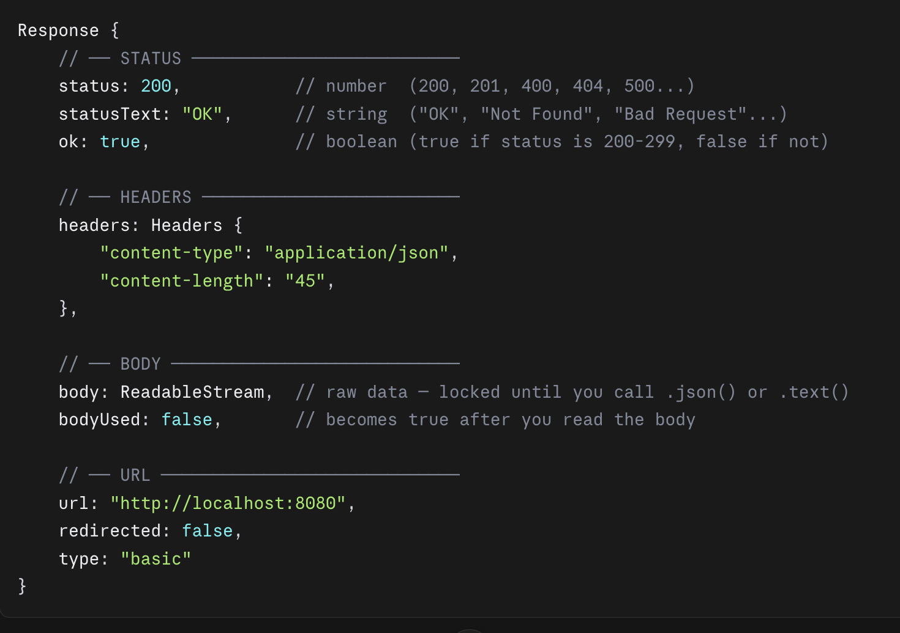
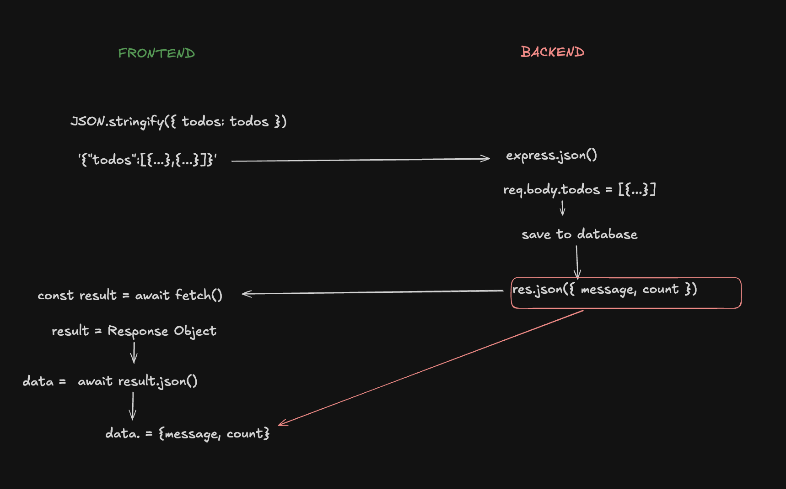

# What Does `const result = await fetch()` Look Like?

## The Simple Idea

`fetch()` does **not** give you the data directly.  
It gives you a **Response Object** first — like getting a sealed envelope.  
You need to **open the envelope** with `.json()` to get the actual data.

---

## How Response object looks like generally 


## Simple Example

```typescript
const result = await fetch("https://api.example.com/user")

// result is NOT your data yet
// result looks like this:
// Response {
//     status: 200,
//     ok: true,
//     body: ReadableStream  ← data is locked inside
// }

const data = await result.json() // open the envelope

// NOW data is your actual data:
// { name: "John", age: 25 }

console.log(data.name) // "John"
```

---

## Real Example — Saving Todos (POST Request)

### Frontend Code

```typescript
const result = await fetch("http://localhost:8080/save", {
    method: "POST",
    headers: {
        "Content-Type": "application/json"
    },
    body: JSON.stringify({ todos: todos })
    // todos = [{ task: "hit the legs", check: false }, ...]
    // after stringify → '{"todos":[{"task":"hit the legs","check":false}]}'
})

// result = Response Object (envelope)
// Response {
//     status: 200,
//     ok: true,
//     body: ReadableStream ← your data is still locked here
// }

const data = await result.json() // open the envelope

// NOW data =
// {
//     message: "all the todos are saved",
//     count: 2
// }

console.log(data.message) // "all the todos are saved"
console.log(data.count)   // 2
```

### Backend Code (what is sending the response)

```typescript
res.status(200).json({
    message: "all the todos are saved",
    count: databasesaving.count   // this is what frontend receives
})
```

---

## Visual — Step by Step



---

## Why Two `await` ?

```typescript
const result = await fetch(...)       // wait for SERVER to respond
const data   = await result.json()   // wait for BODY to be read
```

| Step | `await` | Waits For |
|------|---------|-----------|
| `await fetch()` | 1st | Server to send response |
| `await result.json()` | 2nd | Body stream to finish reading |

---

## Common Mistake

```typescript
// ❌ Wrong — trying to use result directly
const result = await fetch("http://localhost:8080", { ... })
console.log(result.message) // undefined ❌
console.log(result.count)   // undefined ❌

// ✅ Correct — open with .json() first
const result = await fetch("http://localhost:8080", { ... })
const data = await result.json()
console.log(data.message)   // "all the todos are saved" ✅
console.log(data.count)     // 2 ✅
```

---

## One Line Summary

> `fetch()` gives you the **envelope** (Response Object) —  
> `.json()` **opens the envelope** to get your actual data.