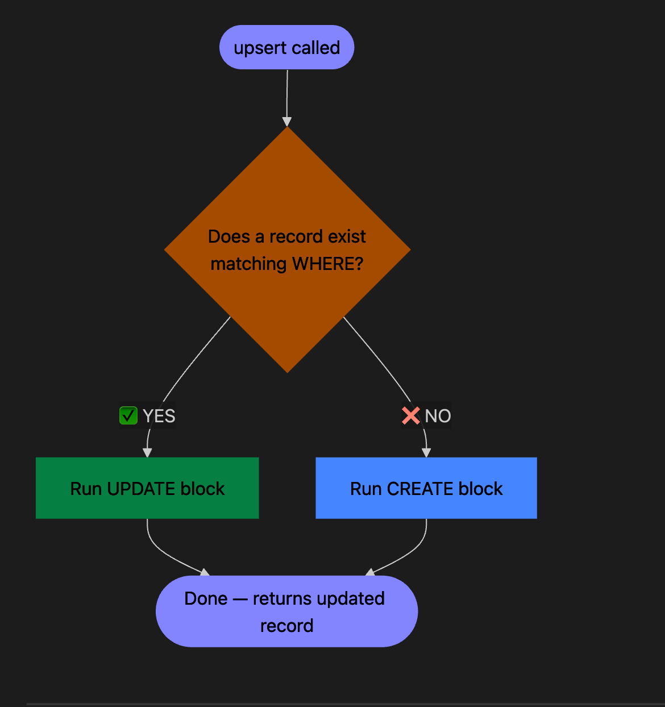

#  Prisma `upsert` — Complete Notes

> [!tip] What is `upsert`?
> **Upsert = Update + Insert**
> If the record **exists** → update it.
> If the record **does NOT exist** → create it.
> One operation. No manual check needed.

---

## How It Works — The Mental Model

```
upsert({
  where:  { unique_field: value },  
  update: { ...fields },             
  create: { ...fields },      
})
```

> [!warning] `where` MUST use a unique field
> Prisma enforces this at the **type level**.
> Only fields marked `@id` or `@unique` in your schema are valid here.

---

##  Flowchart — Decision Logic



---

##  Syntax Template

```typescript
const result = await prisma.modelName.upsert({
  where: {
    uniqueField: value,       // must be @id or @unique
  },
  update: {
    field1: newValue,         // only changed fields needed
    field2: newValue,
  },
  create: {
    uniqueField: value,       // all required fields
    field1: value,
    field2: value,
  },
});
```

---

##  Example 1 — Basic: User Profile Sync

> **Scenario:** A user logs in via Google OAuth. Create their profile on first login, update `lastLogin` on subsequent ones.

```typescript
const user = await prisma.user.upsert({
  where: { email: "ali@example.com" },
  update: {
    lastLogin: new Date(),
  },
  create: {
    email: "ali@example.com",
    name: "Ali",
    lastLogin: new Date(),
  },
});
```

> [!success] Why this is great
> No need to first `findUnique` then decide between `create` or `update`. One DB round-trip.

---

##  Example 2 — Settings / Config Per User

> **Scenario:** Every user has app settings. Save them whether they exist or not.

```typescript
const settings = await prisma.userSettings.upsert({
  where: { userId: "user_123" },   // userId is @unique
  update: {
    theme: "dark",
    language: "en",
  },
  create: {
    userId: "user_123",
    theme: "dark",
    language: "en",
    notifications: true,           // default only on create
  },
});
```

> [!note] Tip
> Notice `notifications: true` is only in `create`. On update, it won't be touched — existing value is preserved.

---

##  Example 3 — Product Inventory Sync (Intermediate)

> **Scenario:** You receive a product feed. Upsert each product by its `sku`.

```typescript
const products = [
  { sku: "SHOE-001", name: "Air Max", price: 120, stock: 50 },
  { sku: "SHOE-002", name: "Jordan 1", price: 180, stock: 30 },
];

for (const product of products) {
  await prisma.product.upsert({
    where: { sku: product.sku },
    update: {
      price: product.price,
      stock: product.stock,
    },
    create: {
      sku: product.sku,
      name: product.name,
      price: product.price,
      stock: product.stock,
    },
  });
}
```

> [!tip] Better with `Promise.all`
> ```typescript
> await Promise.all(products.map(product =>
>   prisma.product.upsert({ ... })
> ));
> ```

---

##  Example 4 — Inside a Transaction (Your Case!)

> **Scenario:** Upsert inside a `tx` (transaction) — ensures atomicity with other operations.

```typescript
const result = await prisma.$transaction(async (tx) => {
  const exercise = await tx.exercise.upsert({
    where: { slug: "push-up" },         // @unique field
    update: {
      updatedAt: new Date(),
    },
    create: {
      slug: "push-up",
      name: "Push Up",
      muscleGroup: "chest",
      createdAt: new Date(),
      updatedAt: new Date(),
    },
  });

  // other tx operations here...
  return exercise;
});
```

> [!warning] `where: {}` is invalid
> An empty `where: {}` will throw a **TypeScript compile error**.
> You must always provide the unique identifier value.

---

##  Common Mistakes

| Mistake | Why it fails | Fix |
|---|---|---|
| `where: {}` empty | No unique key to look up | Always pass the unique field value |
| Using non-unique field in `where` | Prisma type error | Use `@id` or `@unique` fields only |
| Missing required fields in `create` | Runtime DB error | `create` must satisfy all required schema fields |
| Expecting `update` to set defaults | `update` only runs when record exists | Put defaults in `create` only |

---

##  upsert vs Alternatives

| Method                           | Use when                                        |
| -------------------------------- | ----------------------------------------------- |
| `upsert`                         | You don't know if record exists, one key lookup |
| `create`                         | You are 100% sure record doesn't exist          |
| `update`                         | You are 100% sure record exists                 |
| `findUnique` + `create`/`update` | You need conditional logic before deciding      |

---

##  Schema Example (for context)

```prisma
model User {
  id        String   @id @default(cuid())
  email     String   @unique           // ✅ valid for where
  name      String
  lastLogin DateTime
}

model Exercise {
  id          String @id @default(cuid())
  slug        String @unique           // ✅ valid for where
  name        String
  muscleGroup String
  createdAt   DateTime
  updatedAt   DateTime
}
```

---

> [!abstract] Summary in One Line
> **`where` = find it. Found? → `update`. Not found? → `create`.**


do you see this 